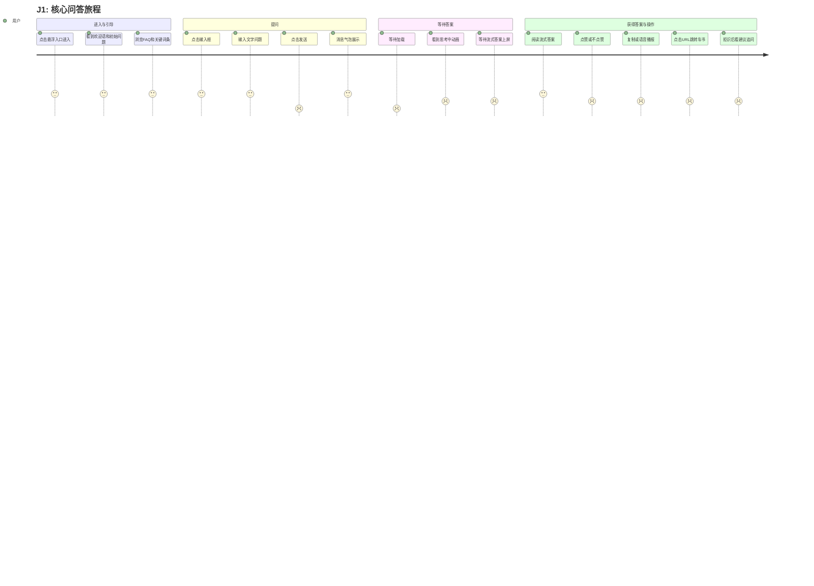
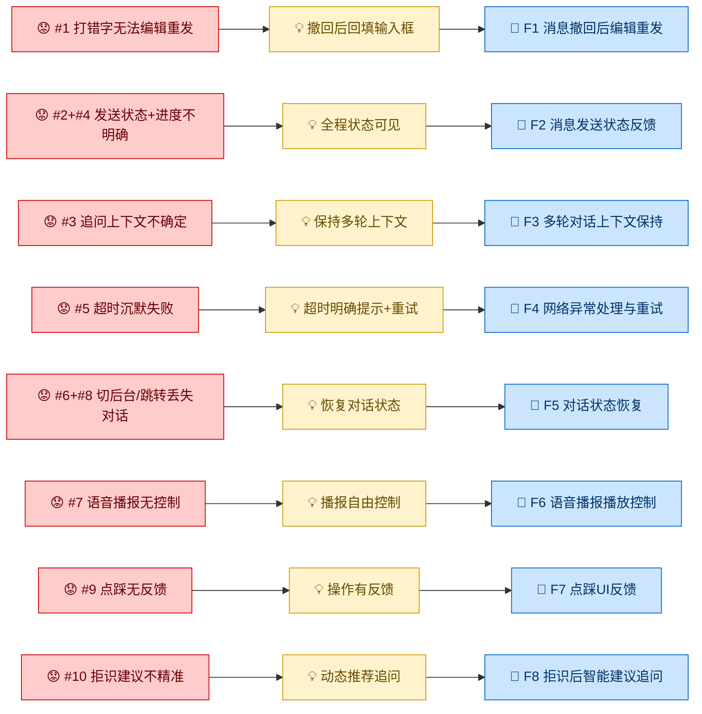
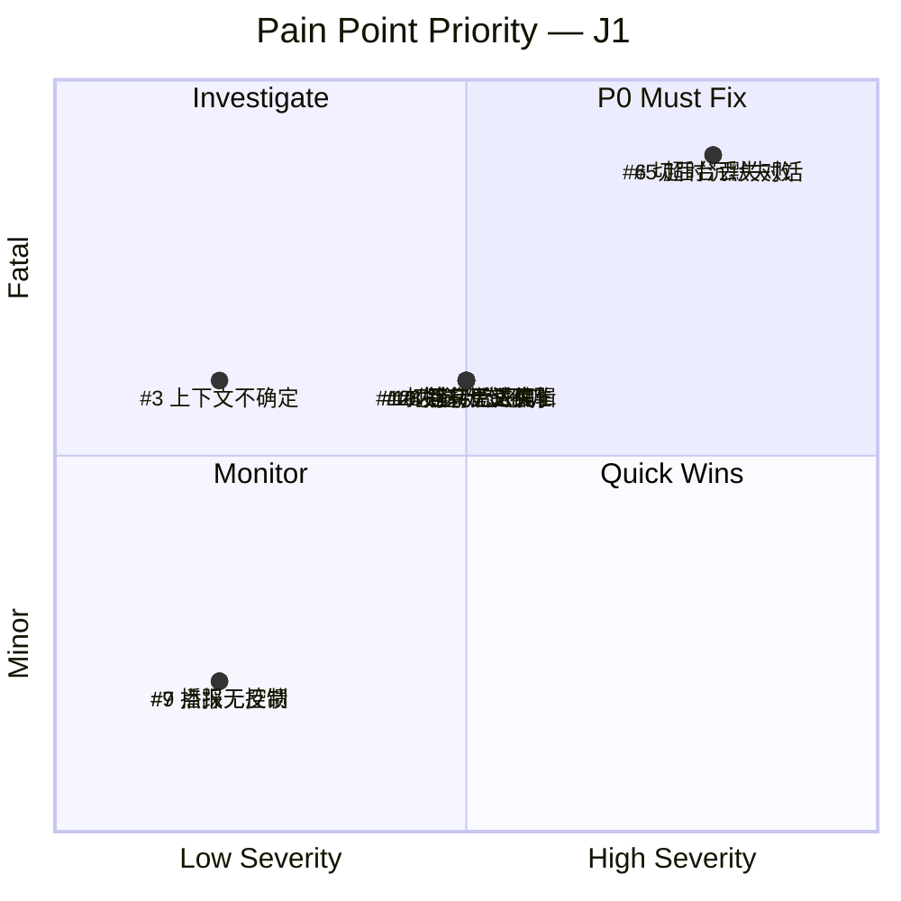

# Journey: J1 核心问答旅程

## Persona

P1 - 卡车司机, P2 - 车队管理员, P3 - 潜在购车用户

## Trigger

用户用车时遇到需要查车书的问题，点击 APP 悬浮小机器人进入卡车助手

## Completion Criteria

用户通过自然语言提问，获得了基于官方车书的准确答案，并完成期望操作（反馈/复制/播报/跳转），对回答质量满意。若拒识，用户拿到了引导建议并可以继续追问。

## Source

- **Capability**: C1 - 智能问答引擎, C3 - 答案交互与反馈
- **Conceptual Scenes**: C1 ~S1, ~S2, ~S3, ~S4, ~S5; C3 ~S1, ~S2, ~S3

## Phases

### Phase 1: 进入与引导

**用户动作:**
1. 在 APP 首页点击悬浮小机器人入口
2. 看到欢迎语 + 初始问题卡片（横向滑动）
3. 浏览分类标签栏下的常用问题 FAQ
4. 看到关键词条推荐（运营配置）
5. 决定点击某个 FAQ/关键词条 或 自行输入问题

**系统触点:** APP 页面、云端配置（关键词条）

**产品支撑（现状）:** 无（新建功能）

**情绪:** → 中性 — 引导清晰，三层信息架构（欢迎语/初始问题/分类标签），无显著摩擦

### Phase 2: 提问

**用户动作:**
1. 点击输入框，键盘弹起
2. 输入文字问题（如"方向盘怎么调"）
3. 点击发送按钮
   - ⚠️ 问题 #1: 发送后才发现打错字，撤回后需重新手打
   - ⚠️ 问题 #2: 发送后不知道系统是否收到，没有状态反馈
   - ⚠️ 问题 #3: 多轮追问时不确定 AI 是否还记得上下文
4. 消息以气泡形式出现在对话区

**系统触点:** APP 输入组件、键盘、云端车书 Agent API

**产品支撑（现状）:** 无（新建功能）

**情绪:** ↓ 负向 — 三个摩擦点叠加让用户担心 AI 听不懂，不敢放心追问

### Phase 3: 等待答案

**用户动作:**
1. 消息气泡出现，系统开始处理
2. 对话区出现"思考中"加载动画
   - ⚠️ 问题 #4: 等待时没有进度感知，不知道是"在搜"还是"卡死"
   - ⚠️ 问题 #5: 网络超时后沉默失败，没有明确提示和重试入口
   - ⚠️ 问题 #6: 等待中切后台，回来发现页面被回收，对话丢失
3. 若网络超时或请求失败，期待明确的错误提示

**系统触点:** 云端车书 Agent API、网络层

**产品支撑（现状）:** 无（新建功能）

**情绪:** ↓ 负向 — 卡车场景网络不稳定，等待焦虑高，超时无兜底

### Phase 4: 获得答案与操作

**用户动作:**
1. 答案流式逐字上屏，用户阅读中
2. 答案生成完毕，底部展示操作区（点赞/不点赞、复制、语音播报）
3. 若答案包含车书章节 URL，展示可点击的跳转链接
4. 用户点击点赞或不点赞
   - ⚠️ 问题 #9: 点踩没有 UI 反馈，用户觉得点了没用
5. 用户点击复制答案
6. 用户点击语音播报
   - ⚠️ 问题 #7: 语音播报缺少暂停/停止控制，长答案只能干等
7. 用户点击 URL 跳转 APP 内车书模块对应章节
8. 从车书模块返回，恢复对话页
   - ⚠️ 问题 #8: 跳转车书模块后回来，对话可能丢失

**拒识分支:**
- 若云端返回拒识，展示拒识文案 + 2-3 个建议追问
  - ⚠️ 问题 #10: 建议追问不够精准，与用户实际想问的不相关
- 用户点击建议追问，直接发送

**系统触点:** APP 渲染层、TTS 语音引擎、APP 内车书模块

**产品支撑（现状）:** 无（新建功能）

**情绪:** ↓ 负向 — 答案有了但操作不顺畅，播报无法控制，跳转后状态丢失

## Pain Points Summary

| # | Phase | Step | 痛点 | 严重度 | 关键度 | 边界检查 |
|---|---|---|---|---|---|---|
| 1 | P2 | 发送 | 打错字后无法编辑重发，需重新手打 | 中 | 重要 | ✅ 范围内 |
| 2 | P2 | 发送 | 发送后不知道系统是否收到，发送状态不明确 | 中 | 重要 | ✅ 范围内 |
| 3 | P2 | 发送 | 追问时不确定上下文是否还在 | 低 | 重要 | ✅ 范围内 |
| 4 | P3 | 等待 | 等待无进度感知，不知道卡住还是处理中 | 中 | 重要 | ✅ 范围内 |
| 5 | P3 | 等待 | 网络超时沉默失败，无提示无重试 | 高 | 致命 | ✅ 范围内 |
| 6 | P3 | 等待 | 切后台回来页面回收，对话丢失 | 高 | 致命 | ✅ 范围内 |
| 7 | P4 | 播报 | 语音播报缺少暂停/停止控制 | 低 | 一般 | ✅ 范围内 |
| 8 | P4 | 跳转 | 跳转车书后回来，对话可能丢失 | 中 | 重要 | ✅ 范围内 |
| 9 | P4 | 反馈 | 点踩没有 UI 反馈 | 低 | 一般 | ✅ 范围内 |
| 10 | P4 | 拒识 | 建议追问不够精准，与用户问题不相关 | 中 | 重要 | ✅ 范围内 |

## Opportunities

| Pain Point | Opportunity | → Feature |
|---|---|---|
| #1 打错字无法编辑重发 | 如果能撤回后自动回填到输入框，用户就能快速修改而非重新手打 | F1 |
| #2+#4 发送状态+进度不明确 | 如果能展示分阶段状态（发送中→查找中→生成中），用户就知道进度 | F2 |
| #3 追问上下文不确定 | 如果能保持多轮对话上下文，用户就能放心追问 | F3 |
| #5 超时沉默失败 | 如果能超时后展示明确提示+重试按钮，用户就能重新发起 | F4 |
| #6+#8 切后台/跳转丢失对话 | 如果能恢复上次对话状态，用户切回来就能继续 | F5 |
| #7 语音播报无控制 | 如果能暂停/停止语音播报，用户就能自由控制 | F6 |
| #9 点踩无反馈 | 如果点踩后 toast 感谢反馈，用户就知道操作被记录 | F7 |
| #10 拒识建议不精准 | 如果能根据用户已有问题动态推荐相关追问，用户就能更快找到答案 | F8 |

## Feature Mapping

| Phase | Pain Point | Feature | ~F Status |
|---|---|---|---|
| P2 | #1 打错字无法编辑重发 | F1 消息撤回后编辑重发 | C2 ~F5 ✅ verified |
| P2+P3 | #2+#4 发送状态+进度不明确 | F2 消息发送/加载状态反馈 | New (Journey-discovered) |
| P2 | #3 追问上下文不确定 | F3 多轮对话上下文保持 | C2 Session 管理 |
| P3 | #5 超时沉默失败 | F4 网络异常处理与重试 | New (Journey-discovered) |
| P3+P4 | #6+#8 切后台/跳转丢失对话 | F5 对话状态恢复 | C2 Session 管理 |
| P4 | #7 语音播报无控制 | F6 语音播报播放控制 | C3 ~F9 ✅ verified |
| P4 | #9 点踩无反馈 | F7 点踩 UI 反馈 | C3 ~F7 ✅ verified |
| P4 | #10 拒识建议不精准 | F8 拒识后智能建议追问 | C1 ~F3 ✅ verified |
| — | — | — | C2 ~F4 历史会话加载 ❓ J2 覆盖 |
| — | — | — | C2 ~F6 清空聊天记录 ❓ J2 覆盖 |

## Gap Analysis

### Feature Gaps
无 — 所有 Phase 的 Fatal/Important 痛点均有 Feature 支撑。

### Feature Orphans
- C2 ~F4 历史会话加载 — 由 J2 覆盖
- C2 ~F6 清空聊天记录 — 由 J2 覆盖

## Diagrams

### Journey Emotion Map

### Feature Derivation Chain

### Service Blueprint

```mermaid
flowchart TD
    subgraph P1["Phase 1: 进入与引导"]
        direction TB
        subgraph U1["👤 用户动作"]
            U1S1["点击悬浮入口"]
            U1S2["浏览欢迎语/FAQ/关键词"]
        end
        subgraph T1["🖥️ 系统触点"]
            T1A["APP页面"]
            T1B["云端配置"]
        end
        subgraph PR1["⚙️ 产品支撑（现状）"]
            PR1A["无（新建）"]
        end
        U1 --> T1 --> PR1
    end
    subgraph P2["Phase 2: 提问"]
        direction TB
        subgraph U2["👤 用户动作"]
            U2S1["输入文字"]
            U2S2["点击发送"]
        end
        subgraph T2["🖥️ 系统触点"]
            T2A["APP输入组件"]
            T2B["键盘"]
            T2C["车书Agent API"]
        end
        subgraph PR2["⚙️ 产品支撑（现状）"]
            PR2A["无（新建）"]
        end
        U2 --> T2 --> PR2
    end
    subgraph P3["Phase 3: 等待答案"]
        direction TB
        subgraph U3["👤 用户动作"]
            U3S1["等待加载"]
            U3S2["看到思考中动画"]
        end
        subgraph T3["🖥️ 系统触点"]
            T3A["车书Agent API"]
            T3B["网络层"]
        end
        subgraph PR3["⚙️ 产品支撑（现状）"]
            PR3A["无（新建）"]
        end
        U3 --> T3 --> PR3
    end
    subgraph P4["Phase 4: 获得答案与操作"]
        direction TB
        subgraph U4["👤 用户动作"]
            U4S1["阅读流式答案"]
            U4S2["点赞/复制/播报/跳转"]
            U4S3["拒识后看建议追问"]
        end
        subgraph T4["🖥️ 系统触点"]
            T4A["APP渲染层"]
            T4B["TTS语音引擎"]
            T4C["APP内车书模块"]
        end
        subgraph PR4["⚙️ 产品支撑（现状）"]
            PR4A["无（新建）"]
        end
        U4 --> T4 --> PR4
    end
    P1 --> P2 --> P3 --> P4
```

### Pain Point Priority

## Status

Confirmed

---

*Created: 2026-09-02*
*Updated: 2026-09-02*