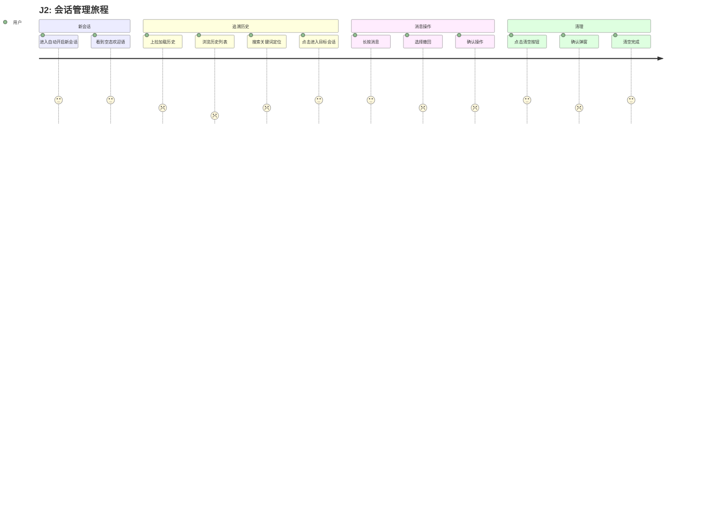
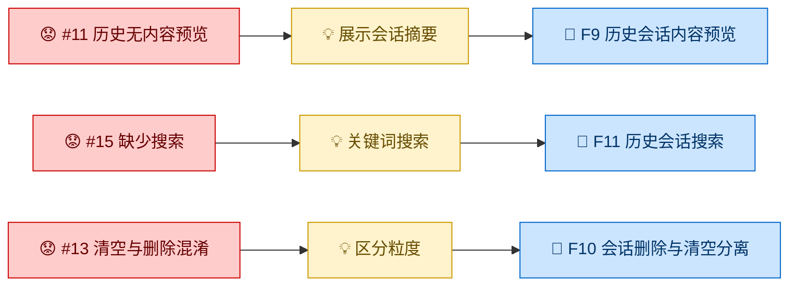

# Journey: J2 会话管理旅程

## Persona

P1 - 卡车司机, P2 - 车队管理员, P3 - 潜在购车用户

## Trigger

用户需要管理对话记录（回顾历史、操作消息、清理记录）

## Completion Criteria

用户能自由管理对话——回顾历史、搜索定位、操作消息、清理记录，不受上下文断裂或粒度混淆困扰。

## Source

- **Capability**: C2 - 对话体验管理
- **Conceptual Scenes**: C2 ~S1, ~S2, ~S3, ~S4

## Phases

### Phase 1: 新会话

**用户动作:**
1. 点击悬浮入口进入卡车助手
2. 系统自动开启新会话
3. 展示空态欢迎语 + 引导
   - ⚠️ 问题 #14: 每次进入新会话，上次没问完的上下文断了，想继续追问需重新解释

**系统触点:** APP 页面

**产品支撑（现状）:** 无（新建功能）

**情绪:** → 中性 — 例行进入，但上下文断裂会带来挫败

### Phase 2: 追溯历史

**用户动作:**
1. 上拉加载历史会话
   - ⚠️ 问题 #11: 历史会话列表只有时间戳，没有内容预览，定位困难
2. 在搜索框中输入关键词
   - ⚠️ 问题 #15: 历史会话多了之后翻找困难，缺少搜索入口
3. 看到匹配结果，点击目标会话进入

**系统触点:** APP 页面、本地/云端存储

**产品支撑（现状）:** 无（新建功能）

**情绪:** ↓ 负向 — 历史多了翻找困难，像在翻一本没有目录的书

### Phase 3: 消息操作

**用户动作:**
1. 长按自己已发送的消息
2. 弹出操作菜单（撤回、引用、复制、删除）
3. 用户选择撤回
   - ⚠️ 问题 #12: 撤回与流式生成时间冲突——答案已开始上屏，撤回是撤回问题还是撤回整个对话
4. 系统执行操作并更新 UI

**系统触点:** APP 交互层、云端同步

**产品支撑（现状）:** 无（新建功能）

**情绪:** ↓ 负向 — 撤回窗口与 AI 即时响应冲突，用户不确定操作范围

### Phase 4: 清理

**用户动作:**
1. 点击清空聊天记录按钮
2. 弹出确认弹窗
   - ⚠️ 问题 #13: 清空与删除粒度混淆——用户可能只想删当前会话，而非全部历史
3. 用户确认，系统清空所有记录

**系统触点:** APP 页面、本地/云端存储

**产品支撑（现状）:** 无（新建功能）

**情绪:** → 中性 — 例行操作，但粒度不清晰带来不安

## Pain Points Summary

| # | Phase | Step | 痛点 | 严重度 | 关键度 | 边界检查 |
|---|---|---|---|---|---|---|
| 11 | P2 | 查看 | 历史会话列表仅时间戳，无内容预览 | 高 | 重要 | ✅ 范围内 |
| 12 | P3 | 撤回 | 撤回与流式生成时间冲突 | 中 | 重要 | ✅ 范围内 |
| 13 | P4 | 清空 | 清空与删除粒度混淆 | 低 | 一般 | ✅ 范围内 |
| 14 | P1 | 进入 | 每次新会话断了上次追问上下文 | 中 | 重要 | ✅ 范围内 |
| 15 | P2 | 搜索 | 历史会话多了翻找困难，缺少搜索 | 高 | 重要 | ✅ 范围内 |

## Opportunities

| Pain Point | Opportunity | → Feature |
|---|---|---|
| #11 历史无内容预览 | 如果能展示会话摘要（首问+时间），用户就能快速定位 | F9 |
| #12 撤回与流式冲突 | 如果能允许在答案生成前撤回+编辑重发，用户就能纠正错误 | → 合并到 F1 |
| #13 清空与删除混淆 | 如果能区分"删除当前会话"和"清空全部记录"，用户就能精确操作 | F10 |
| #14 新会话断上下文 | 如果历史会话点击进入后可继续追问，用户就能延续上次对话 | → 合并到 F3 |
| #15 缺少搜索 | 如果能提供关键词搜索历史会话，用户就能快速定位 | F11 |

## Feature Mapping

| Phase | Pain Point | Feature | ~F Status |
|---|---|---|---|
| P2 | #11 历史无内容预览 | F9 历史会话内容预览 | C2 ~F4 ✅ verified |
| P3 | #12 撤回与流式冲突 | → 合并到 F1 | C2 ~F5 ✅ verified |
| P4 | #13 清空与删除混淆 | F10 会话删除与清空分离 | C2 ~F6 ✅ verified |
| P1 | #14 新会话断上下文 | → 合并到 F3 | C2 Session 管理 |
| P2 | #15 缺少搜索 | F11 历史会话搜索 | New (Journey-discovered) |

## Gap Analysis

### Feature Gaps
无 — 所有 Fatal/Important 痛点均有 Feature 支撑。

### Feature Orphans
无 — 所有 Feature 均有对应 Phase + Pain Point。

## Diagrams

### Journey Emotion Map

### Feature Derivation Chain

### Service Blueprint

```mermaid
flowchart TD
    subgraph P1["Phase 1: 新会话"]
        direction TB
        subgraph U1["👤 用户动作"]
            U1S1["点击入口进入"]
            U1S2["看到新会话空态"]
        end
        subgraph T1["🖥️ 系统触点"]
            T1A["APP页面"]
        end
        subgraph PR1["⚙️ 产品支撑（现状）"]
            PR1A["无（新建）"]
        end
        U1 --> T1 --> PR1
    end
    subgraph P2["Phase 2: 追溯历史"]
        direction TB
        subgraph U2["👤 用户动作"]
            U2S1["上拉加载历史"]
            U2S2["搜索关键词"]
            U2S3["点击进入会话"]
        end
        subgraph T2["🖥️ 系统触点"]
            T2A["APP页面"]
            T2B["本地/云端存储"]
        end
        subgraph PR2["⚙️ 产品支撑（现状）"]
            PR2A["无（新建）"]
        end
        U2 --> T2 --> PR2
    end
    subgraph P3["Phase 3: 消息操作"]
        direction TB
        subgraph U3["👤 用户动作"]
            U3S1["长按消息"]
            U3S2["选择撤回/引用/复制/删除"]
        end
        subgraph T3["🖥️ 系统触点"]
            T3A["APP交互层"]
            T3B["云端同步"]
        end
        subgraph PR3["⚙️ 产品支撑（现状）"]
            PR3A["无（新建）"]
        end
        U3 --> T3 --> PR3
    end
    subgraph P4["Phase 4: 清理"]
        direction TB
        subgraph U4["👤 用户动作"]
            U4S1["点击清空"]
            U4S2["确认弹窗"]
        end
        subgraph T4["🖥️ 系统触点"]
            T4A["APP页面"]
            T4B["本地/云端存储"]
        end
        subgraph PR4["⚙️ 产品支撑（现状）"]
            PR4A["无（新建）"]
        end
        U4 --> T4 --> PR4
    end
    P1 --> P2 --> P3 --> P4
```

## Status

Confirmed

---

*Created: 2026-09-02*
*Updated: 2026-09-02*